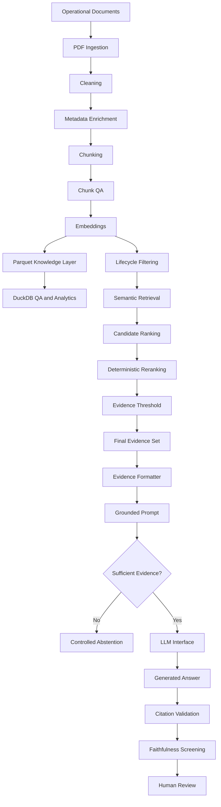

# Healthcare Document Intelligence RAG

## Project Overview

This project is a governed operational-policy intelligence assistant designed for NHS-style environments.

Its purpose is to help staff find the right current operational guidance quickly, trace every answer back to source evidence, and avoid unsupported responses when the available evidence is weak or out of scope.

The system is not designed as a generic chatbot.

It is designed as a controlled evidence assistant for operational guidance.

---

## NHS Operational Problem

Operational teams may need to work across multiple documents such as:

- escalation policies
- workforce procedures
- bed-capacity guidance
- winter-pressure plans
- business-continuity procedures
- governance standards

Common risks include:

- time lost searching multiple documents
- staff finding outdated guidance
- inconsistent interpretation
- weak traceability
- difficulty proving which source supported an answer
- AI systems generating plausible but unsupported responses

This project addresses those risks through governed retrieval and grounded answer generation.

---

## What the System Does

The current prototype can:

- ingest and clean operational documents
- preserve source and lifecycle metadata
- split documents into traceable evidence chunks
- create semantic embeddings
- retrieve evidence based on meaning
- exclude Superseded, Draft and Archived guidance
- detect stale embeddings
- rank and rerank candidate evidence
- reject weak evidence using a configurable threshold
- format approved evidence for generation
- prevent normal generation when no reliable evidence exists
- generate answers only from supplied evidence
- preserve source, version, page and chunk provenance
- validate citation identifiers
- perform baseline claim-support checks
- record retrieval and answer evaluation metrics

---

## Plain-English Example

A manager asks:

> What should operational leadership do during escalation?

The system:

1. searches the approved operational-document corpus
2. identifies the most relevant current policy evidence
3. excludes outdated versions
4. checks whether the evidence is strong enough
5. supplies only approved evidence to the language model
6. generates a concise explanation
7. shows the supporting source, version, page and chunk
8. validates that the model did not invent a source

If no reliable evidence exists, the system abstains instead of guessing.

---

## Architecture



## Portfolio Evidence

This repository demonstrates:

- healthcare-focused data engineering
- metadata and provenance design
- semantic retrieval
- RAG architecture
- lifecycle-aware governance
- evaluation engineering
- hallucination-risk controls
- prompt-injection awareness
- SQL-style analytical thinking with DuckDB
- test-driven Python development
- enterprise migration thinking
- NHS management communication

## Evaluation Status

The evaluation framework is implemented.

Performance metrics should only be reported from executed benchmark runs.

Placeholder or illustrative figures are not presented as measured project results.


## Week 18 — Governed Retrieval & Human Review

Week 18 upgraded the project from a retrieval prototype into a more controlled operational evidence assistant.

### What was added

- Semantic retrieval benchmark
- BM25 keyword retrieval
- Hybrid retrieval
- RRF-only comparison
- Active-only lifecycle enforcement
- Deterministic query-scope gate
- Abstention controls
- Human-review routing
- Confidence and score-gap rules
- Structured audit records

### Benchmark results

| Method | Top-1 | Top-k | Abstention | Active-only |
|---|---:|---:|---:|---:|
| Semantic | 70% | 90% | 100% | 100% |
| BM25 | 20% | 40% | 100% | 100% |
| Hybrid | 70% | 90% | 100% | 100% |
| RRF-only | 40% | 50% | 100% | 100% |

A key finding was that more complex retrieval did not automatically improve performance. Semantic retrieval remained the strongest baseline, while the existing reranking stage added value over RRF-only fusion.

### Safety finding

Initially, unsupported questions could still retrieve semantically related operational documents.

Examples included:

- medication prescribing;
- antibiotic dosing;
- current external leadership questions.

A deterministic scope gate improved abstention success from:

`0% → 100%`

without reducing semantic retrieval performance.

### Human-review outcomes

The system now routes queries to:

- `AUTO_ANSWER`
- `REVIEW_REQUIRED`
- `ABSTAIN`

Across the 14-case benchmark:

| Outcome | Cases |
|---|---:|
| AUTO_ANSWER | 3 |
| REVIEW_REQUIRED | 8 |
| ABSTAIN | 3 |

The design deliberately prioritises traceability and human accountability over unsupported automation.

### Current governed flow

```text
Question
↓
Scope Gate
↓
Retrieval
↓
Lifecycle Filtering
↓
Reranking
↓
Evidence Assessment
↓
AUTO_ANSWER / REVIEW_REQUIRED / ABSTAIN
↓
Grounded Answer or Human Review
↓
Audit Record
```
